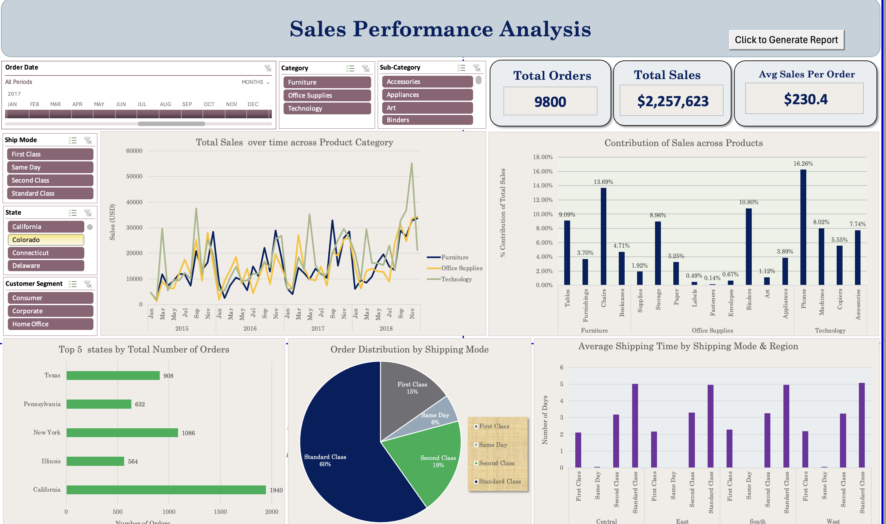

# Sales Performance Analysis Dashboard Using Excel
Designed an interactive Excel dashboard to analyze sales trends, customer segmentation, product analytics, and geographic insights with time-based analysis for seasonal trends. Implemented VBA macros with event-driven programming to automate data updates, dynamic filtering, and report generation.

## **Objective**

The objective of the **Sales Performance Analysis Dashboard** was to create a comprehensive, interactive, and automated solution for analyzing sales performance across multiple dimensions. This dashboard enables businesses to gain actionable insights by dynamically filtering data, visualizing key metrics, and generating automated reports based on user-defined filters. 

Key goals included:
- Integrate multiple datasets (Customers, Orders, and Sales) into a unified, analytics-ready dataset using SQL for efficient querying and scalable processing.
- Design an intuitive Excel dashboard that offers dynamic insights into sales trends, customer segments, top-performing products, regional patterns, and shipping preferences.
- Implement automation using VBA to streamline data updates, apply user-defined filters, and generate custom PDF reports without manual intervention.

---

## **Screenshot of the Dashboard**

---

## **Steps Taken**

### **1. Data Integration and Transformation**

- **Datasets Used**:
  - **Customers Dataset**: Contained Customer ID, Name, Segment, and other details.
  - **Orders Dataset**: Included Order ID, Order Date, Ship Mode, State, and related attributes.
  - **Sales Dataset**: Provided transactional data like Product, Sales Amount, Quantity, and Profit.

- **Data Cleaning and Preprocessing**:
 To ensure accuracy, scalability, and clean data structure, all raw datasets were first imported into a SQL database and processed through a structured data engineering workflow.
SQL was used to clean and standardize all tables before analysis:

- Remove duplicates
- Fix date formats
- standardize category & segment text fields
- Ensure referential integrity across tables

### 🧹 SQL Data Cleaning

-- Standardize date formats
UPDATE orders
SET 
    order_date = CONVERT(date, order_date),
    ship_date  = CONVERT(date, ship_date);

-- Remove duplicate customers
DELETE FROM customers
WHERE customer_id IN (
    SELECT customer_id
    FROM (
        SELECT 
            customer_id,
            ROW_NUMBER() OVER (
                PARTITION BY customer_id 
                ORDER BY customer_name
            ) AS rn
        FROM customers
    ) t
    WHERE rn > 1
);

---

### **2. Dashboard Design**

The dashboard was created in Excel with a focus on interactivity, clarity, and ease of use.

#### **Key Visualizations**:
- **Line Chart**: Tracks total sales over time, segmented by product categories.
- **Bar Chart**: Highlights contributions of sales across products.
- **Pie Chart**: Visualizes order distribution by shipping modes.
- **Horizontal Bar Chart**: Displays the top 5 states by the total number of orders.
- **Column Chart**: Examines average shipping time across shipping modes and regions.

#### **Key Metrics (KPIs)**:
- **Total Orders**: Total number of orders processed.
- **Total Sales**: Cumulative sales amount across all transactions.
- **Average Sales Per Order**: Average revenue generated per order.

#### **Interactive Features**:
- **Slicers**:
  - Filter data by date (month/year), ship mode, product category, sub-category, state, and customer segment.
- **Dynamic Updates**:
  - All visualizations and KPIs update automatically based on slicer selections.

---

### **3. Automation Using VBA**

To enhance usability, VBA was implemented to automate report generation.

#### **Custom Report Generation**:
- A button labeled **"Click to Generate Report"** was added to the dashboard.
- The VBA macro:
  - Consolidates filtered data from PivotTables affected by slicers.
  - Creates a new worksheet with the report structured as:
    - **Section Headers**: "Analysis -> Sheet Name."
    - **Data with Colorful Headers**: Filtered data is organized for clarity.
  - Exports the report as a **PDF** with the current date in the filename.

#### **Key VBA Features**:
- **Event-Driven Execution**: Macro executes only when the button is clicked.
- **Formatting Automation**:
  - Automatically formats the report (e.g., column auto-fit, borders, colorful headers).
- **Dynamic Data Handling**:
  - Loops through PivotTables to extract only filtered, visible data.

---

## **Results Achieved**

### **1. Unified Dataset**
- Successfully combined the **Customers**, **Orders**, and **Sales** datasets into a single structured table, enabling seamless analysis and visualization.

### **2. Key Insights Derived from the Dashboard**:
- **Sales Trends**:
  - Sales peaked during specific months, driven by **Technology** and **Furniture** categories.
  - **Office Supplies** showed consistent, moderate growth across the timeline.
- **Shipping Mode Analysis**:
  - **Standard Class** accounted for 60% of all orders, making it the most popular shipping mode.
- **State Performance**:
  - **California** had the highest number of orders among all states.
- **KPI Highlights**:
  - **Total Orders**: **9800**
  - **Total Sales**: **$2,257,623**
  - **Average Sales Per Order**: **$230.4**

### **3. Automated Report Generation**:
- Users can generate on-demand reports by applying slicers and clicking the **Generate Report** button.
- Reports are formatted professionally with section headers and colorful headers.
- Reports are exported as PDFs for easy sharing and distribution.

## **Conclusion**

The **Sales Performance Analysis Dashboard** is a comprehensive tool that enables stakeholders to:
- Track and analyze key sales metrics.
- Gain insights into customer segments, product performance, and shipping preferences.
- Generate professional, shareable reports at the click of a button.

By leveraging advanced Excel techniques and VBA automation, this dashboard significantly improves efficiency and enhances data-driven decision-making. The ability to export reports as PDFs ensures that insights are easily shareable across teams, making this solution an invaluable asset for any organization.

---

